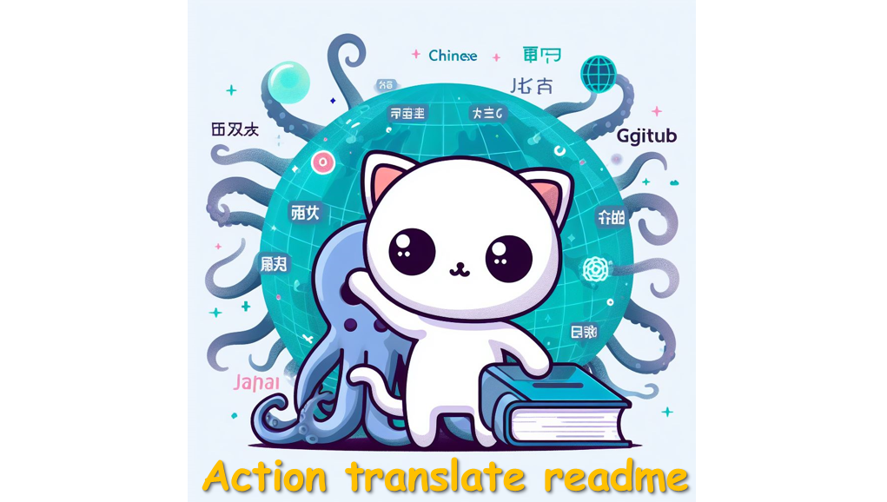

```markdown
# action-translate-readme

<p align="center">
    
</p>

* [English](README.md)
* [繁體中文版README.md](README.zh-TW.md)
* [简体中文](README.zh-CN.md)
* [Française](README.French.md)
* [عربى](README.Arabic.md)


# مقدمة

> [!NOTE]
> إصدار `v1` من المترجم يتم تحقيقه من خلال حزم جهات خارجية في `Linux`؛ الإصدار `v2` يتم تحقيقه عن طريق استدعاء [`g4f`](https://github.com/xtekky/gpt4free) لـ openai api مجانًا للترجمة.


* نعلم جميعًا أن كتابة ملف README تستغرق وقتًا طويلاً، ولكن الآن هناك حلاً يمكن أن يوفر لك نصف الوقت. وهذا هو `action-translate-readme` لدينا.

* ترجمة إصدارات README بلغات مختلفة باستخدام `gpt3.5`

* تقديم ملفات README بعد الترجمة تلقائيًا عبر **Github Actions(CI/CD)**

* على سبيل المثال: **الكتابة** أو **تعديل** ملف README باللغة الإنجليزية، ستنشأ تلقائياً إصدارات باللغة الصينية التقليدية والصينية المبسطة والفرنسية ... الخ.


# كيفية الاستخدام؟


> [!IMPORTANT]
> نظرًا لأن `gpt3.5` هو نموذج AI الجيل الإنشائي، فإن كل نتيجة ترجمة لها احتمالية لظهور مشكلة، نوصي باستخدام اختبار الفروع وتجربة عدة مرات.

> [!WARNING]
> إذا واجهتك الخطأ التالي: `Error: Input required and not supplied: token`، يرجى التأكد من أنك قمت بإنشاء `Token` وفقًا للخطوة الثانية، أو تحقق من انتهاء صلاحية `Token`!


1. انقر على :star: لإضافة هذا المشروع إلى مستودع Github الخاص بك.

2. قم بتعيين `Github Token` الخاص بك:

    * [أنشئ **`Github Secret Token`** جديد](https://github.com/settings/tokens/new)
        * قم بالإعداد
        * إعدادات المطور
        * رمز الوصول الشخصي - `Tokens(classic)`
        * إنشاء رمز وصول جديد
        * اختر **دورة حياة الرمز** - من المستحسن استخدام **دائم**
        * اختر النطاق: `repo` و `workflow`
        * **احتفظ** برمزك السري (لا تفقده، ستحتاج إليه في المستقبل)

        

    * أنشئ **`repository secret`** جديد
        * في مستودعك - `settings`
        * `Securits and variables`
        * `Actions`
        * `New repository secret`
        * أدخل تسمية `token` واسم (مثال: `Action_Bot`)

        

3. قم بإنشاء مثال لعملك في المجلد `.github/workflows/your_action.yml`. ، يمكنك نسخ الآتي مباشرة:

    ```
    # .github/workflows/translate.yml
    name: Translate Readme

    on:
        push:
            branches: ['**']

    jobs:
        translate:
            runs-on: ubuntu-latest
            steps:
                - name: Checkout
                  uses: actions/checkout@v3
                  with:
                    fetch-depth: 3

                - name: Auto Translate
                  uses: Lin-jun-xiang/action-translate-readme@v2 # Based on the tag
                  with:
                    token: ${{ secrets.Action_Bot }} # Based on step2 name
                    langs: "en,zh-TW,zh-CN,French,Arabic" # You can define any langs
    ```

    هناك ثلاثة معلمات تحتاج إلى الانتباه إليها في `.yml`:

    * `token`: استنادًا إلى الخطوة 2، رمز الوصول الذي تم إنشاؤه في مستودعك
    * `langs`: الإصدارات التي ترغب في إنشائها بلغات مختلفة، تأكد من استخدام `,` لفصل اللغات المختلفة، على سبيل المثال:
      * `"en"`: ترجمة الإصدار الإنجليزي فقط
      * `"en,zh-TW"`: ترج