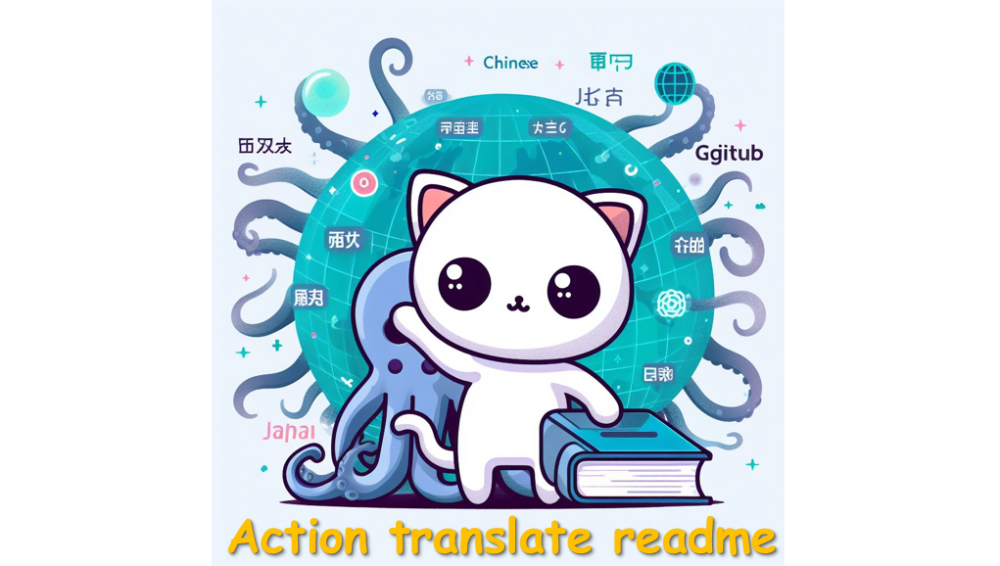

# action-translate-readme

<p align="center">
    
</p>

* [الإنجليزية](README.md)
* [الصينية التقليديةREADME.md](README.zh-TW.md)
* [الصينية البسيطة](README.zh-CN.md)
* [فرنسية](README.French.md)
* [عربى](README.Arabic.md)


# المقدمة

> [!NOTE]
> تم تنفيذ مترجم الإصدار `v1` من خلال حزمة جد parties `Linux`؛ الإصدار `v2` تم تحقيقه عبر [`g4f`](https://github.com/xtekky/gpt4free) استدعاء مجاني لـ openai api لتحقيق الترجمة.


* نعلم جميعًا أن كتابة وثائق README تستغرق وقتًا كبيرًا ، ولكن الآن هناك حلاً يمكن أن يوفر لك نصف الوقت. هذا هو `action-translate-readme` لدينا.

* ترجمة إصدارات مختلفة من README باستخدام `gpt3.5`

* تقديم **Github Actions(CI/CD) الإلتزام(commit، push)** تلقائيًا للملف المترجم

* على سبيل المثال: **كتابة** أو **تعديل** إصدار اللغة الإنجليزية من README، توليد تلقائيًا إصدارات اللغات مثل الصينية التقليدية والصينية البسيطة والفرنسية وما إلى ذلك.


# كيفية الاستخدام؟


> [!IMPORTANT]
> نظرًا لأن `gpt3.5` ينتمي إلى نموذج AI توليدي ، فإن هناك احتمالًا لحدوث مشكلات في كل نتيجة للترجمة ، نقترح استخدام فحص الفروع وتجربة عدة مرات.

> [!WARNING]
> إذا واجهتك الخطأ التالي: `Error: Input required and not supplied: token` ، يرجى التحقق بناءً على الخطوة الثانية مما إذا كنت قد قمت بإنشاء `Token` ، أو ما إذا كان الـ `Token` قد انتهت صلاحيته!


1. انقر على :star: الرمز لإضافة هذا المشروع إلى مستودع GitHub الخاص بك.

2. قم بتكوين `Github Token` الخاص بك:

    * [أنشئ **`Github Secret Token`** جديد](https://github.com/settings/tokens/new)
        * الإعدادات
        * إعدادات المطور
        * الرموز الشخصية للوصول - `Tokens(classic)`
        * إنشاء رمز جديد
        * حدد **دورة حياة** للرمز - نوصي باستخدام **غير محدود مباشرة**
        * حدد النطاق:`repo` و `workflow`
        * **احتفظ** برمزك السري (لا تفقده ، ستحتاج إليه في المستقبل)

        

    * أنشئ **`repository secret`** جديدًا
        * في مستودعك - `الإعدادات`
        * `Securits and variables`
        * `Actions`
        * `New repository secret`
        * اضغط `token` وأدخل تسمية العلامة والتسمية (مثل: `Action_Bot`)

        

3. في الدليل `.github/workflows/your_action.yml`. قم بإنشاء مثال للعمل الخاص بك ، يمكنك نسخه مباشرة:

    ```yaml
    # .github/workflows/translate.yml
    name: Translate Readme

    on:
        push:
            branches: ['**']

    jobs:
        translate:
            runs-on: ubuntu-latest
            steps:
                - name: Checkout
                  uses: actions/checkout@v3
                  with:
                    fetch-depth: 3

                - name: Auto Translate
                  uses: Lin-jun-xiang/action-translate-readme@v2 # استنادًا إلى العلامة
                  with:
                    token: ${{ secrets.Action_Bot }} # استنادًا إلى اسم الخطوة2
                    g4f_provider: g4f.Provider.DeepAi # يمكنك تغيير مزود هذا
                    langs: "en,zh-TW,zh-CN,French,Arabic" # يمكنك تحديد أي لغات
                  # openai_api_key: ${{ secrets.OPENAI_API_KEY }} # إذا قدمت مفتاح openai api ، سيتم استخدام openai gpt بدلاً من gpt4free
    ```

> [!NOTE]
> هناك