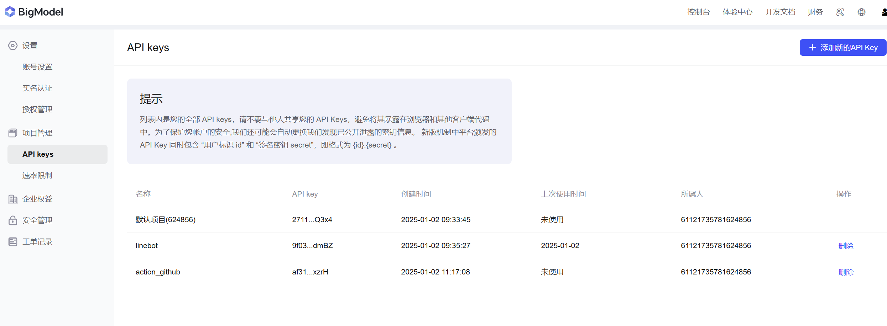
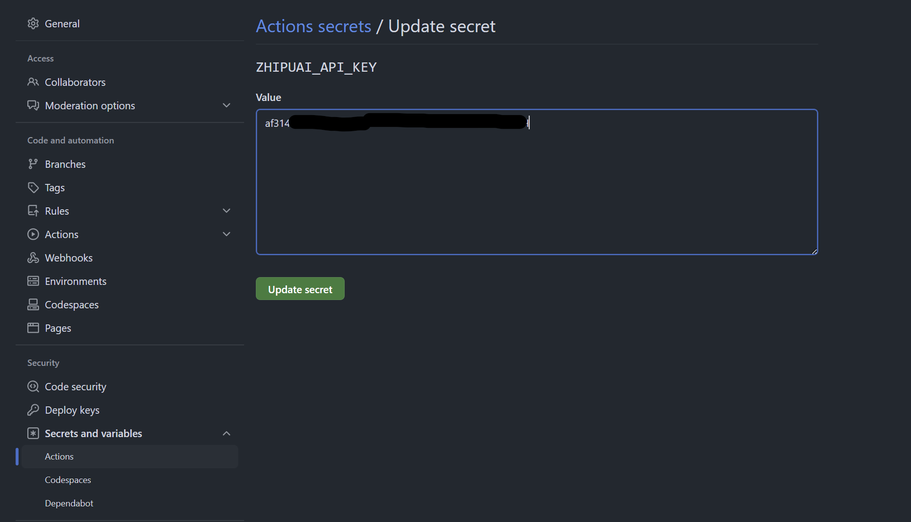
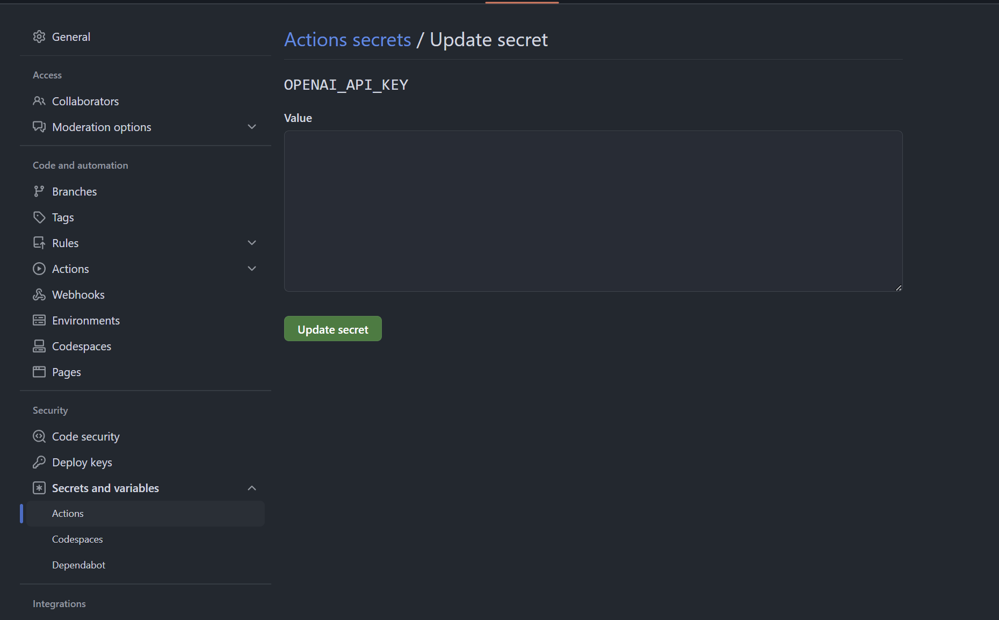

# action-translate-readme

* [English](README.md)
* [繁體中文版README.md](README.zh-TW.md)
* [简体中文](README.zh-CN.md)
* [Française](README.French.md)

# Introduction

**GitHub Action to translate Readme to any language**

这是一个GitHub Action，可以自动将您仓库中的readme翻译成指定的语言。

> [!NOTE]
> `v1` 版本的翻译器是通过 `Linux` 第三方包实现的；`v2` 版本是通过生成式AI进行翻译的


* 我们都知道编写README文档很耗时，但现在有一个解决方案可以为您节省一半的时间。那就是我们的 `action-translate-readme`

* 通过**生成式AI**翻译不同语言版本的README

* 通过**GitHub Actions (CI/CD)**自动**提交并推送**翻译后的文件

* 例如：**编写**或**修改**英文版本的README，自动生成繁体中文、简体中文、法语...等版本的README


# How to use ?

> [!IMPORTANT]
> 由于生成式AI模型的翻译结果偶尔可能存在问题，建议在分支上进行操作，最后再合并回主分支。

> [!WARNING]
> 如果您遇到此错误：`Error: Input required and not supplied: token`，请确保按照下面第二步建立`Token`，或者检查`Token`是否过期！

1. 点击 :star: 图标将此项目添加到您的GitHub仓库。

2. 设置您的`GitHub Token`（**必填**）：

    1. [创建一个新的**`GitHub Secret Token`**](https://github.com/settings/tokens/new)
        * Settings
        * Developer settings
        * Personal access tokens - `Tokens(classic)`
        * Generate new token
        * 选择token的**有效期** - 建议使用**永久**
        * 范围选择：`repo` 和 `workflow`
        * **保存**您的密钥token（不要丢失，稍后需要粘贴）

        

    2. 将GitHub Token添加到**`仓库密钥`**
        * 在您的仓库中 - `settings`
        * `安全和变量`
        * `Actions`
        * `New repository secret`
        * 填写标签并命名为`token`（例如，`Action_Bot`）

        

3. 选择GPT翻译模型（**可选**）
   
   * `g4f`：**默认**使用**免费**的`g4f`进行OpenAI调用以完成翻译任务。
   * `zhipuai`：如果您需要**免费且稳定的翻译**，可以在[智谱AI平台](https://open.bigmodel.cn/dev/howuse/introduction)注册账号并[申请API KEY](https://open.bigmodel.cn/usercenter/proj-mgmt/apikeys)，这是一个完全免费的GPT模型，无需信用卡。
     * 要使用此选项，请按照**步骤2-2**中添加GitHub Token的方法，并将**智谱AI的API KEY添加到GitHub仓库的密钥中**。

        

        

   * `openai`：**保证高质量和稳定质量**，如果您有OPENAI API KEY，将使用`gpt-4o`作为翻译模型。
     * 要使用此选项，请按照**步骤2-2**中添加GitHub Token的方法，并将**OpenAI的API KEY添加到GitHub仓库的密钥中**。

        

4. 在`.github/workflows/your_action.yml`中创建您的action示例。您可以直接复制以下内容：

    ```yaml
    # .github/workflows/translate.yml
    name: Translate Readme

    on:
        push:
            branches: ['**']

    jobs:
        translate:
            runs-on: ubuntu-latest
            steps:
                - name: Checkout
                  uses: actions/checkout@v3
                  with:
                    fetch-depth: 3

                - name: Auto Translate
                  uses: Lin-jun-xiang/action-translate-readme@v2 # 根据标签
                  with:
                    token: ${{ secrets.Action_Bot }} # 根据步骤2的名称
                    zhipuai: ${{ secrets.zhipuai_api_key }} # 可选：根据步骤3
                    openai: ${{ secrets.openai_api_key }}  # 可选：根据步骤3
                    langs: "en,zh-TW,zh-CN,French,Arabic" # 您可以定义任何语言
    ```

    注意`.yml`中的几个参数：

    * `token`：用于授权操作的GitHub Token（按照第二步添加）。
    * `zhipuai`：智谱API，按照第三步添加（可选）
    * `openai`：OpenAI API，按照第三步添加（可选）
    * `langs`：指定要翻译的语言，务必用`,`分隔不同的语言，例如：
      * `"en"`：仅翻译英文版本
      * `"en,zh-TW"`：翻译英文、繁体中文
      * `"French,Arabic"`：翻译法语、阿拉伯语

    > PS：如果未将`zhipuai`或`openai`添加到GitHub Secrets，将使用`g4f`进行翻译。

5. 现在您可以更新`README.md`，它将自动生成翻译版本！

---

# Demo


# Results of Test Document

* 查看[测试文档](https://github.com/Lin-jun-xiang/ChatGPT-line-bot)，该文档使用了我们的工具进行文档更新。

<a href="#top">Back to top</a>